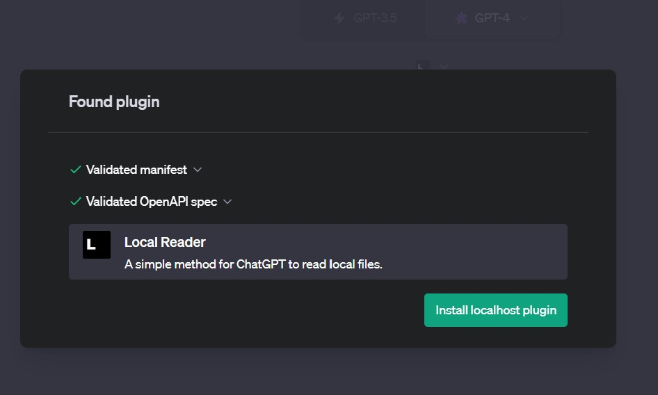
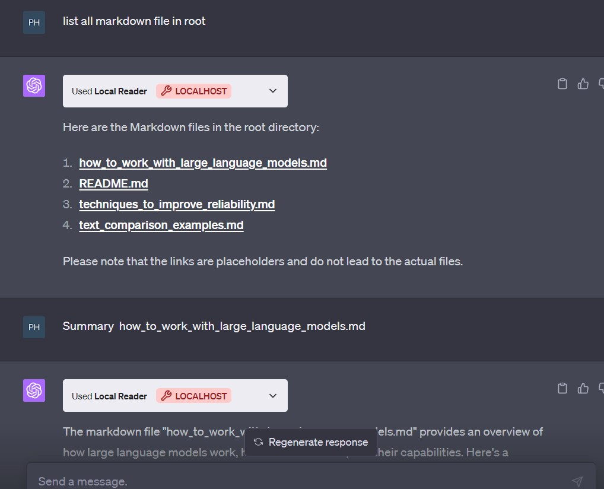

# ChatGPT Local Reader Plugin

This is the simplest method for ChatGPT to read local files, providing a straightforward and efficient way to extend ChatGPT's capabilities.

## Usage

Just copy `server.py` and `.well-known` to your directory.

```bash
python server.py
```

and then install localhost plugin in ChatGPT.



## Example


